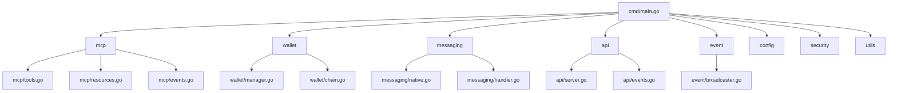

# Algonius Wallet Native Host 项目结构说明

> **依赖说明**：mcp 相关功能统一依赖 [github.com/mark3labs/mcp-go](https://github.com/mark3labs/mcp-go) v0.29.0，已在 go.mod 明确声明。

本文件基于最新技术文档与接口规范，详细说明 native-host 子项目的推荐代码组织结构、各模块职责、设计原则及可视化结构图，便于团队开发、扩展与维护。

---

## 测试策略说明

详细测试策略、目录结构与最佳实践请参见 [native/docs/testing.md](docs/testing.md)。

---

## 1. 顶层目录结构

```
native/
├── cmd/                # 程序入口与启动逻辑
│   └── main.go
├── pkg/                # 业务核心模块（推荐每个领域单独子包）
│   ├── mcp/            # MCP Server与工具/资源注册、协议处理
│   │   ├── server.go
│   │   ├── tools.go
│   │   ├── resources.go
│   │   ├── events.go
│   │   └── schema.go
│   ├── wallet/         # 钱包管理、多链支持、密钥存储与签名
│   │   ├── manager.go
│   │   ├── account.go
│   │   ├── transaction.go
│   │   ├── chain.go
│   │   └── status.go
│   ├── messaging/      # Chrome Native Messaging协议与扩展通信
│   │   ├── native.go
│   │   ├── handler.go
│   │   └── types.go
│   ├── api/            # HTTP/SSE接口（如需REST/SSE对外）
│   │   ├── server.go
│   │   ├── events.go
│   │   └── middleware.go
│   ├── event/          # 事件广播与订阅（可与mcp/events.go合并）
│   │   ├── broadcaster.go
│   │   └── types.go
│   ├── config/         # 配置加载与管理
│   │   └── config.go
│   ├── security/       # 加密、权限校验、风控
│   │   ├── crypto.go
│   │   ├── auth.go
│   │   └── risk.go
│   └── utils/          # 通用工具函数
│       └── ...
├── test/               # 单元测试与集成测试
│   ├── mcp_test.go
│   ├── wallet_test.go
│   ├── messaging_test.go
│   └── ...
├── Makefile
├── go.mod
└── go.sum
```

---

## 2. 结构设计说明

### 2.1 cmd/

- 仅包含 main.go，负责参数解析、配置加载、各核心模块初始化与启动。

### 2.2 pkg/mcp/

- MCP Server主逻辑，负责所有工具/资源注册、协议解析、会话管理、事件推送。
- tools.go/resources.go：每个MCP工具/资源单独实现，便于扩展和测试。
- events.go：SSE事件流与订阅管理。
- schema.go：所有MCP接口的输入/输出/错误schema定义。

### 2.3 pkg/wallet/

- 钱包管理与多链支持，包含账户、交易、链适配、状态管理等。
- manager.go：统一调度各链钱包。
- account.go/transaction.go/chain.go：各自领域实现。
- status.go：钱包状态快照与查询。

### 2.4 pkg/messaging/

- Chrome Native Messaging协议实现，处理与浏览器扩展的通信。
- native.go：主通信逻辑。
- handler.go：各类消息处理分发。
- types.go：消息结构体定义。

### 2.5 pkg/api/

- HTTP/SSE接口（如需REST API或SSE事件推送）。
- server.go：API服务入口。
- events.go：SSE事件流。
- middleware.go：权限校验、日志等中间件。

### 2.6 pkg/event/

- 事件广播与订阅，采用观察者模式，支持多客户端（AI Agent、Browser Extension）。
- broadcaster.go：事件分发与管理。
- types.go：事件结构体定义。

### 2.7 pkg/config/

- 配置加载、环境变量、密钥路径等。

### 2.8 pkg/security/

- 加密算法、权限校验、多签/硬件钱包/风控等安全增强逻辑。

### 2.9 pkg/utils/

- 通用工具函数（如日志、格式化、错误处理等）。

### 2.10 test/

- 单元测试与集成测试，按模块分文件，便于自动化与持续集成。

---

## 3. 设计原则

- **高内聚低耦合**：每个子包聚焦单一领域，接口清晰，便于扩展和维护。
- **接口驱动**：所有MCP工具/资源、钱包操作、事件推送均以接口形式暴露，便于Mock与测试。
- **安全优先**：敏感操作与密钥管理单独隔离，权限校验与风控逻辑集中管理。
- **多链可扩展**：wallet/chain.go支持新链快速接入，MCP工具/资源注册自动化。
- **事件驱动**：event/与mcp/events.go统一事件流，支持SSE与Native Messaging双通道推送。
- **测试先行**：test/目录结构与pkg/一致，便于全链路自动化测试。

---

## 4. Mermaid 结构图



---

本结构完全对齐 Algonius Wallet 技术文档与MCP接口规范，便于后续功能开发、测试与安全增强。如需具体文件内容或代码模板，可进一步细化每个子包的接口与实现建议。
